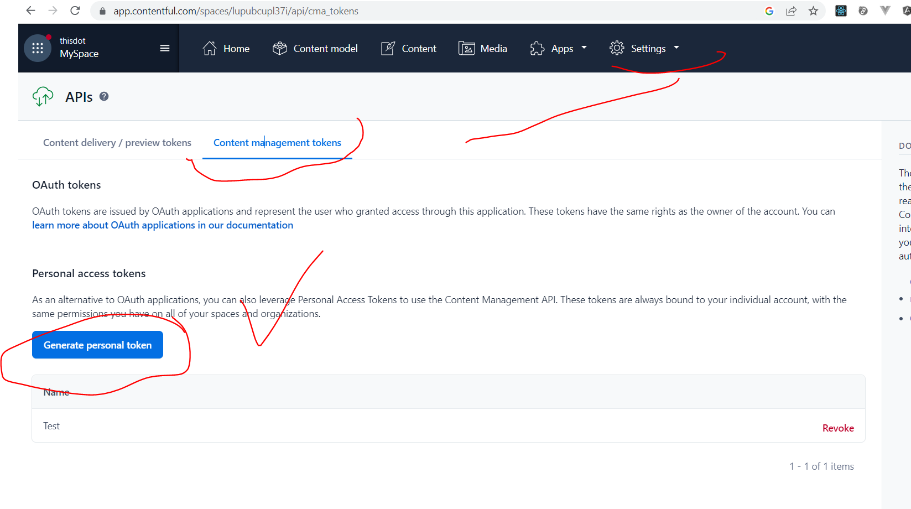
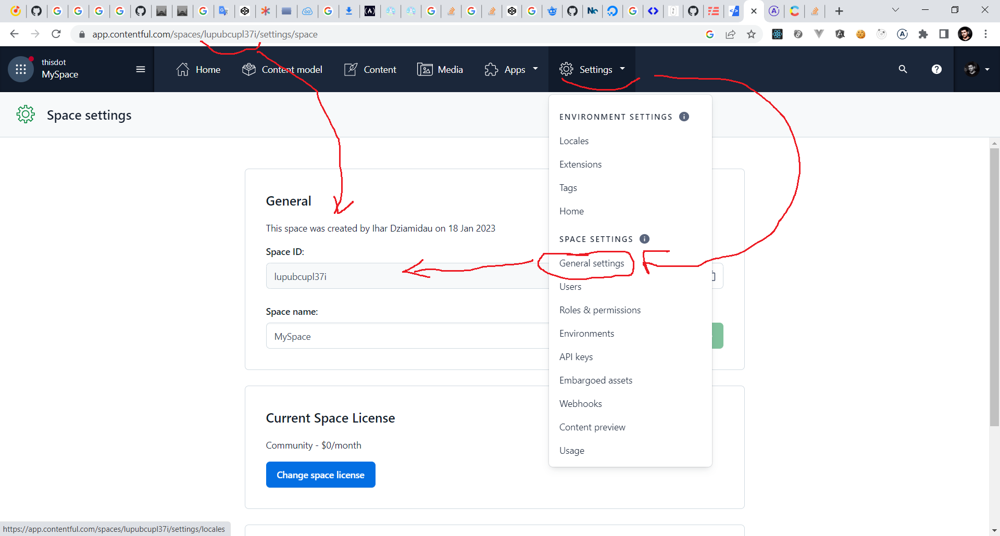
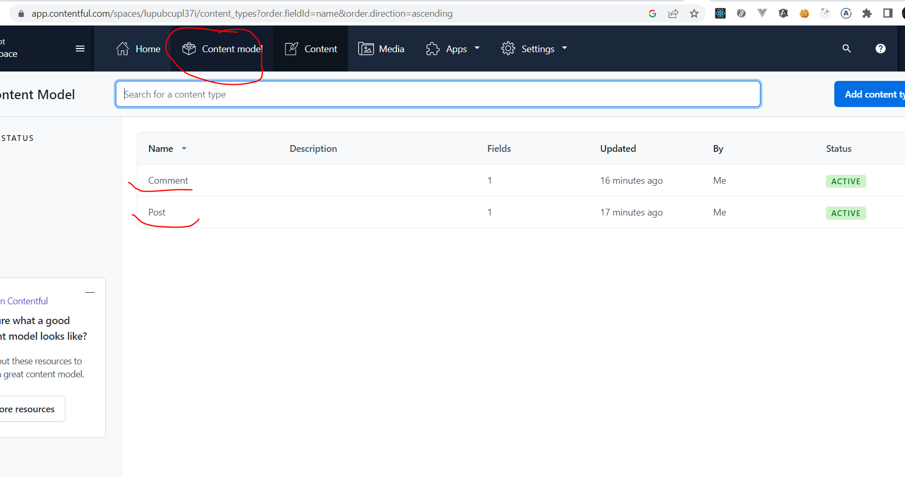

# serverless-framework-apollo-contentful starter kit

This starter kit features **Serverless**, **GraphQL**, **Apollo Server**, and **Contentful**.

## Overview

### Tech Stack

- [GraphQL](https://graphql.org/)
- [Apollo Server v4.x](https://www.apollographql.com/docs/apollo-server/)
- [Serverless v3.x](https://serverless.com/)
- [Contentful CMS](https://www.contentful.com/)

### Included Tooling

- [Jest](https://jestjs.io/) - Test runner
- [TypeScript](https://www.typescriptlang.org/) - Type checking
- [ESLint](https://eslint.org/) - Code linting
- [Prettier](https://prettier.io/) - Code formatting

### Example Code

- `Technology` query to fetch technology data from Contentful

## Installation

### CLI (Recommended)

```bash
npm create @this-dot/starter --kit serverless-framework-apollo-contentful
```

````

or

```bash
yarn create @this-dot/starter --kit serverless-framework-apollo-contentful
````

or

```bash
pnpm create @this-dot/starter --kit serverless-framework-apollo-contentful
```

- Follow the prompts to select the `serverless-framework-apollo-contentful` starter kit and name your new project.
- `cd` into your project directory and run `npm install`.
- Run `npm run dev` to start the development server.
- Open your browser to `http://localhost:3000` to see the included example code running.

### Manual

This requires a download of the entire starter.dev repository and extraction of
the `serverless-framework-apollo-contentful` kit from the starters directory.

```bash
git clone https://github.com/thisdot/starter.dev.git
```

- Copy and rename the `starters/serverless-framework-apollo-contentful` directory to the name of your new project.
- `cd` into your project directory and run `npm install`.
- Run `npm run dev` to start the development server.
- Open your browser to `http://localhost:3000` to see the included example code running.

### Environment variables

Copy the contents of the file `.env.example` into a new `.env` file.

```bash
cp .env.example .env
```

You would need an account with [contentful.com](http://contentful.com) in order to get the environment variables
required:

```bash
CONTENTFUL_CONTENT_MANAGEMENT_API_TOKEN=xxx
CONTENTFUL_SPACE_ID=xxx
CONTENTFUL_ENVIRONMENT=master
```

#### Steps to setup contentful

1. Once you're signed in to contentful create a space

2. When that's done, go to **Settings** -> **API keys**
   Click on **Generate personal token** to get the `CONTENTFUL_CONTENT_MANAGEMENT_API_TOKEN` variable
   

3. Go to **Settings** -> **General settings** to get the `CONTENTFUL_SPACE_ID`
     
   After you've gotten your API TOKEN and Space ID from contentful, modify the `.env` file and replace them with `xxx`.

4. For demo purposes, this kit comes pre-configured with a `Technology` model. To use this, create the content model for
   it in Contentful. The model has `displayName`, `description` and `url` text fields, the `id` field gets provided by
   Contentful.
   

## Commands

- `npm run dev` - Starts the development server.
- `npm run test` - Runs the unit tests.
- `npm run lint` - Runs ESLint on the project.
- `npm run prettier` - Formats code for the entire project
- `npm run deploy` - Deploy your application on `AWS Lambda`

## Project Structure

The demo components included in the starter kit are co-located with the tests. This kit includes things like mocks and data-fetching queries that are modeled after an MVC-type architecture. Using this structure makes it easy to find all
the code and functionality related to a specific component. This pattern follows the single responsibility principle
since each file has one purpose. For example, the `.resolvers.ts` files handle data for all resolvers with the
functionality related to data fetching for your query. The `.test.ts` files handle all the unit tests for the resolvers.
The `.typedefs.ts` files handle all the types for GraphQL.

### Example directory

```
- TechnologyModel.ts - Model for the Technology entity
- technologies.resolvers.ts - Resolvers for the Technology entity
- technologies.test.ts - Unit tests for the Technology entity
- technologies.typedefs.ts - Type definitions for the Technology entity
```

## Technologies

### GraphQL

`GraphQL` is a query language for your API and a server-side runtime for executing queries using a type system you define for your data. In this kit, we use GraphQL to query only the data we require from our `Contentful CMS` space.

### Apollo Server v4.x

`Apollo Server` is an open-source, spec-compliant GraphQL server that's compatible with any GraphQL client, including Apollo Client. It's the best way to build a production-ready, self-documenting GraphQL API that can use data from any source.

`Apollo Server` is great for a straightforward setup, incremental adoption and universal compatibility and production readiness.

### Serverless v3.x

`Serverless` is an all-in-one development solution for auto-scaling apps on AWS Lambda.
Easily define your applications as AWS Lambda functions and their triggers through simple abstract syntax in the `serverless.yaml` file.

`Serverless plugins` extend the Serverless Framework with new features. Plugins in this application include:

- [`serverless-offline](https://github.com/dherault/serverless-offline)` - allows us to deploy our application locally to speed up development cycles.
- [`serverless-plugin-typescript`](https://github.com/graphcool/serverless-plugin-typescript) - use Typescript with zero-config
- [serverless-dotenv-plugin](https://github.com/infrontlabs/serverless-dotenv-plugin) - Preload function environment variables into Serverless.
-

### Contentful CMS

Contentful CMS is a composable content management platform that meets the unique demands of digital content and all the teams that produce and work with it. It allows content creators to focus on assembling, editing, approving and publishing content.

## Deployment

To deploy your application on `AWS lambda` simply run:

```sh
   sls deploy
```

To deploy a single function run:

```sh
   deploy function --function myFunction
```

For more information on checkout this [article](https://www.serverless.com/framework/docs/providers/aws/guide/deploying)
