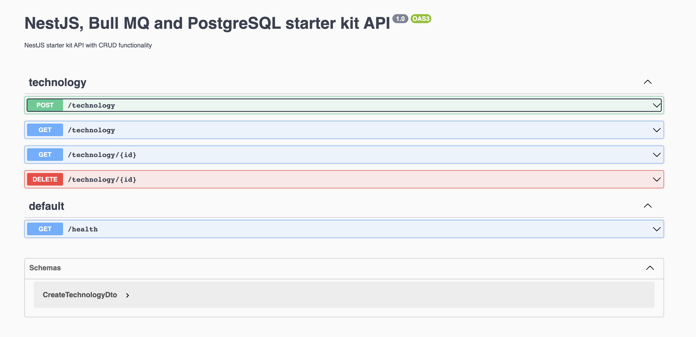

# nestjs-bullmq-postgresql starter kit

This starter kit features NestJS, BullMQ and PostgreSQL.

## Tech Stack

- [NestJS](https://nestjs.com/)
- [PostgreSQL](https://www.postgresql.org/)
- [BullMQ](https://docs.bullmq.io/)

## Included Tooling

- [Jest](https://jestjs.io/)
- [TypeScript](https://www.typescriptlang.org/)
- [Sequelize](https://sequelize.org/)
- [Swagger](https://swagger.io/)
- [ESLint](https://eslint.org/)
- [Prettier](https://prettier.io/)

## CLI Installation

You can choose from either `npm`, `yarn` or `pnpm` to install the kit.

```bash
npm create @this-dot/starter -- --name my-project-name --kit nestjs-bullmq-postgresql
```

```bash
yarn create @this-dot/starter --name my-project --kit nestjs-bullmq-postgresql
```

```bash
pnpm create @this-dot/starter --name my-project-name --kit nestjs-bullmq-postgresql
```

Follow these set of directions to finish setting up your kit.

- `cd` into your project directory and run `npm install`(or `yarn`, `pnpm`).
- Make sure you have [docker](https://docs.docker.com/engine/install/) installed on your machine.
- Create a `.env` file and copy the contents of the `.env.example` into it.
- Create a `.postgres.db.env` file and copy the contents of the `.postgres.db.env.example` into it.
- Run `npm run infrastructure:start` (or `yarn`, `pnpm`) to start the database.
- Run `npm run start` (or `yarn`, `pnpm`) to start the development server.

### Manual installation

```bash
git clone https://github.com/thisdot/starter.dev.git
```

- Copy and rename the `starters/nestjs-bullmq-postgresql` directory to the name of your new project.
- Make sure you have [docker](https://docs.docker.com/engine/install/) installed on your machine.
- `cd` into your project directory and run `npm install`(or `yarn`, `pnpm`).
- Create a `.env` file and copy the contents of the `.env.example` into it.
- Create a `.postgres.db.env` file and copy the contents of the `.postgres.db.env.example` into it.
- Run `npm run infrastructure:start` (or `yarn`, `pnpm`) to start the database.
- Run `npm run start` (or `yarn`, `pnpm`) to start the development server.

## Built-in Scripts

- `npm run infrastructure:start` - Creates and starts all the Docker containers for services from the Docker Compose configuration.
- `npm run infrastructure:stop` - Stops all of the Docker containers for services from the Docker Compose configuration.
- `npm run start` - Starts the Nest application on a local server
- `npm run build` - Builds the Nest application
- `npm run format` - Formats the entire codebase using Prettier
- `npm run lint` - Checks the entire project with ESLint
- `npm run test` - Runs the Jest test suite
- `npm run test:e2e` - Runs the e2e test suite

## Kit Organization / Architecture

Inside the `src` directory, you will find the code for the health check, queue and technology example CRUD implementations.

```
.
├── health
│   ├── health.controller.ts
│   └── health.module.ts
├── queue
│   ├── queue.controller.ts
│   ├── queue.module.ts
│   └── queue.processor.ts
├── technology
│   ├── dto
│   │   └── create-technology.dto.ts
│   ├── technology.controller.spec.ts
│   ├── technology.controller.ts
│   ├── technology.model.ts
│   ├── technology.module.ts
│   └── technology.service.ts
├── app.module.ts
└── main.ts
```

### Health check

Inside the `src/health/health.controller.ts` file, you will find the `HealthController` which uses the `@nestjs/terminus` package to check on the health of your application.

```js
@Controller('health')
export class HealthController {
	constructor(private health: HealthCheckService, private db: SequelizeHealthIndicator) {}

	@Get()
	@HealthCheck()
	checkHealth() {
		return this.health.check([() => this.db.pingCheck('sequelize')]);
	}
}
```

You can check on the health of your app by starting the local server and going to the `http://localhost:3000/health` endpoint.

### Queue

Inside the `src/queue/queue.processor.ts` file, you will find an example `QueueProcessor` class that uses BullMQ.

```js
@Processor('queue')
class QueueProcessor extends WorkerHost {
	async process(job: Job<any, any, string>): Promise<any> {
		console.log(`Processing job ${job}`);
	}

	@OnWorkerEvent('completed')
	onCompleted() {
		console.log('Job Completed');
	}
}
```

### Technology example

Inside the `src/technology` directory, you will find an example of a technology CRUD implementation with tests.

```ts
create(createTechnologyDto: CreateTechnologyDto): Promise<Technology> {
	return this.technologyModel.create({
		displayName: createTechnologyDto.displayName,
		description: createTechnologyDto.description,
		url: createTechnologyDto.url,
	});
}
```
## Swagger UI 

This starter kit uses [Swagger UI](https://swagger.io/tools/swagger-ui/) to show the REST API documentation for the technology and health API's.

You can view the documenation at http://localhost:3000/api

